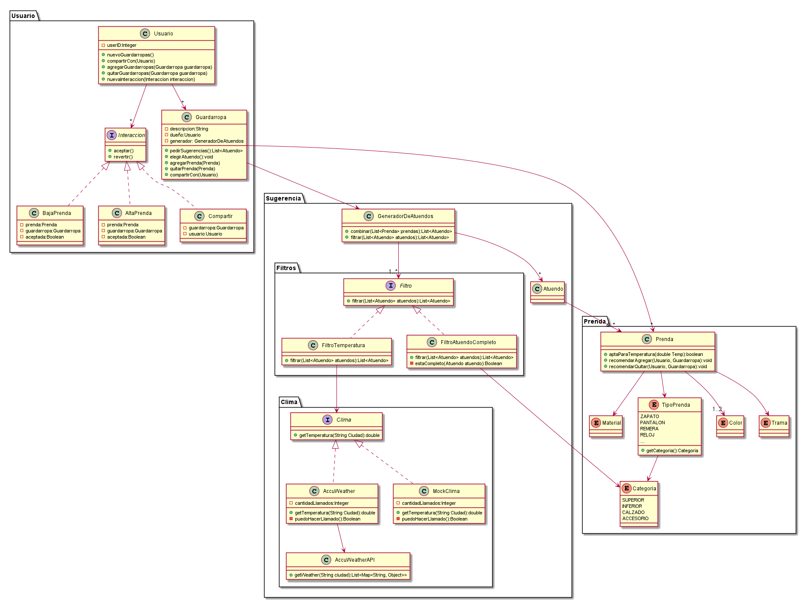

# DDS-QMP Quinta Iteracion
## Faltan cosas en la implementacion, Ej Algoritmo de combinacion de prendas + los Test.

Como usuario de QuéMePongo, quiero compartir mis guardarropas con otras personas.

Por ahora, comenzaremos atacando los siguientes requerimientos específicos:

Como usuario de QuéMePongo, quiero poder manejar varios guardarropas para separar mis prendas según diversos criterios (ropa de viaje, ropa de entrecasa, etc). 

Como usuario de QuéMePongo, quiero poder crear guardarropas compartidos con otros usuarios (ej, ropa que comparto con mi hermano). 

Como usuario de QuéMePongo, quiero que otro usuario me proponga tentativamente agregar una prenda al guardarropas.

Como usuario de QuéMePongo, quiero que otro usuario me proponga tentativamente quitar una prenda del guardarropas.

Como usuario de QuéMePongo, necesito ver todas las propuestas de modificación (agregar o quitar prendas) del guardarropas y poder aceptarlas o rechazarlas..

Como usuario de QuéMePongo, quiero poder deshacer las propuestas de modificación que haya aceptado.

